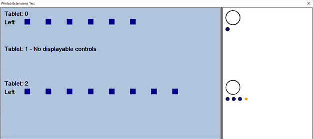
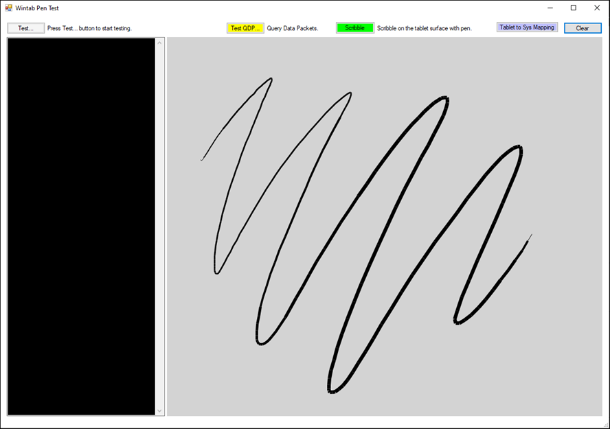

# Getting Started 

## Test Environment
The Wintab .NET demo samples have been provided as two C# applications. To build these sample applications, you will need Windows 7 or above with .NET 4+ and Visual Studio 2017 or above.

To test the applications, a Wacom tablet driver must be installed and a supported Wacom tablet must be attached. All Wacom tablets supported by the Wacom driver are supported by this API. Get the driver that supports your device at: https://www.wacom.com/support/product-support/drivers.


## Wintab SDK License  
```
Copyright (c) 2020, Wacom Technology Corporation
 
Permission is hereby granted, free of charge, to any person obtaining a copy
of this software and associated documentation files (the "Software"), to deal
in the Software without restriction, including without limitation the rights
to use, copy, modify, merge, publish, distribute, sublicense, and/or sell
copies of the Software, and to permit persons to whom the Software is
furnished to do so, subject to the following conditions:
 
THE SOFTWARE IS PROVIDED "AS IS", WITHOUT WARRANTY OF ANY KIND, EXPRESS OR
IMPLIED, INCLUDING BUT NOT LIMITED TO THE WARRANTIES OF MERCHANTABILITY,
FITNESS FOR A PARTICULAR PURPOSE AND NONINFRINGEMENT. IN NO EVENT SHALL THE
AUTHORS OR COPYRIGHT HOLDERS BE LIABLE FOR ANY CLAIM, DAMAGES OR OTHER
LIABILITY, WHETHER IN AN ACTION OF CONTRACT, TORT OR OTHERWISE, ARISING FROM,
OUT OF OR IN CONNECTION WITH THE SOFTWARE OR THE USE OR OTHER DEALINGS IN
THE SOFTWARE.
```

## Install the Wacom tablet driver and verify tablet operation
In order to run the sample applications, it is necessary to install a Wacom tablet driver, which installs the necessary runtime components that support Wintab .NET. The driver can be found at: https://www.wacom.com/support/product-support/drivers

Once the driver has installed and you have rebooted your system, check your tablet driver installation by doing the following:

1. Attach a supported Wacom tablet.
1. Open the Wacom Tablet Properties application (from the Start menu, go to Wacom Tablet >  Wacom Tablet Properties) to confirm your tablet is recognized.
1. Use tablet Pen, ExpressKeys, Touch Ring, and/or Touch Strips to verify functionality.
1. If all of the above checks out, proceed to the next section to build/run the sample application.


## Build/run the sample applications

1. Open the WintabDN.sln file in Visual Studio. The demo includes all SDK header files needed to build with. Other SDK components necessary to run the demo are installed with the tablet driver.
1. There are three projects in the solution:  
	a. ExtensionTestApp  
	b. PenTestApp  
	c. WintabDN (builds WintabDN.dll)
1. From the top menu, select Build > Build Solution.
1. Once built, select the application to start (ExtensionTestApp or PenTestApp) and run the project from Visual Studio Local Windows Debugger.
1. As the app starts, there should be no warnings. If you do see warnings, be sure the driver is running with the attached, supported, tablet as described above.


## ExtensionTestApp
The ExtensionTestApp displays available ExpressKeys, Touch Rings (and modes), as well as Touch Strip information.

This application is an example of how to capture user interactions with tablet controls using Wintab .NET.

To only show attached tablets, reset settings from the Wacom Desktop Center Backup settings section.




## PenTestApp
The PenTestApp displays pen strokes with pressure when the "Scribble" button is pressed.

This application is an example of how to capture pen usage, including position and pressure information, using Wintab .NET.

Other features include the following buttons:

* *Test...* – Runs a set of unit tests on the Wintab .NET API to ensure API function.
* *Test QDP* – Opens a dialog to display context, position, and pressure data for stylus input from the tablet.
* *Tablet to Sys Mapping* – When pressed while testing, gives tablet mapping information.



## WintabDN
Builds the WintabDN.dll (Wintab .NET) used to interface with Wintab.

This is not a test application and can't be run independently.


## See Also
[Wintab - Basics](https://developer-docs.wacom.com/intuos-cintiq-business-tablets/docs/wintab-basics) - How to configure and write Wintab applications  

[Wintab - Reference](https://developer-docs.wacom.com/intuos-cintiq-business-tablets/docs/wintab-reference) - Complete API details 

[Wintab - FAQs](https://developer-docs.wacom.com/intuos-cintiq-business-tablets/docs/wintab-faqs) - Wintab programming tips  

## Where to get help  
If you have questions about the sample application or any of the setup process, please visit our Developer Support page at: https://developer.wacom.com/developer-dashboard/support.
