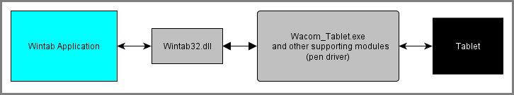

# README

## Introduction
This is a C++ application that uses the WinTab API to receive pen data from multiple attached Wacom tablets and allows the user to measure physical distance on the tablet surface. Specifically, this application measures how many inches or centimeters the Wacom stylus has moved across the tablet surface.

Unlike the [ScribbleDemo](/Wintab%20ScribbleDemo/README.md), which by default opens a System context, CadTest uses Digitizer contexts for the attached tablets. System contexts are used to report Wintab packets as screen coordinates, whereas Digitizer contexts are used to report Wintab packets against the active tablet area.

This sample shows how an application can use Wintab to:

* Connect to Wintab-enabled Wacom tablets.
* Open application-private Wintab Digitizer contexts, one per tablet.
* Receive message notification when pen data is available.
* Receive pen data as raw tablet counts.
* Use a ruler tool (Demo > Ruler Demo) to poll for Wintab data and measure the physical tablet surface distance between two points.

In order to run a sample application, it is necessary to install a Wacom tablet driver, which installs the necessary runtime components that support Wintab. The driver can be found at: https://www.wacom.com/support/product-support/drivers.

## Application Details
The application uses an installed driver module, Wintab32.dll, to communicate with the tablet driver.  If the driver is not installed, is not communicating, or there is no supported Wacom tablet attached, then the program will display an appropriate warning.

The following illustrates a simplified overview of the major Wintab-supporting components:

You can download the sample code and view the inline comments to find out detailed information about the sample code itself.

## See Also
[Wintab - Basics](https://developer-docs.wacom.com/intuos-cintiq-business-tablets/docs/wintab-basics) – How to configure and write Wintab applications

[Wintab - Reference](https://developer-docs.wacom.com/intuos-cintiq-business-tablets/docs/wintab-reference) - Complete API details

[Wintab - FAQs](https://developer-docs.wacom.com/intuos-cintiq-business-tablets/docs/wintab-faqs) - Wintab programming tips

## Where To Get Help
If you have questions about this demo or the Wintab API, please visit our support page: https://developer.wacom.com/developer-dashboard/support

## License
This sample code is licensed under the MIT License: https://choosealicense.com/licenses/mit/