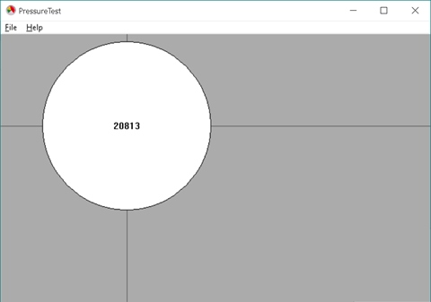

# Getting Started 

## Test Environment
The Wintab demo samples have been provided as C++ applications. To build this sample application, you will need Windows 7 or above with Visual Studio 2017 or above.

To test the application, use a Wacom tablet supported by the latest driver.

## Wintab SDK License
```
Copyright (c) 2020, Wacom Technology Corporation
 
Permission is hereby granted, free of charge, to any person obtaining a copy
of this software and associated documentation files (the "Software"), to deal
in the Software without restriction, including without limitation the rights
to use, copy, modify, merge, publish, distribute, sublicense, and/or sell
copies of the Software, and to permit persons to whom the Software is
furnished to do so, subject to the following conditions:
 
THE SOFTWARE IS PROVIDED "AS IS", WITHOUT WARRANTY OF ANY KIND, EXPRESS OR
IMPLIED, INCLUDING BUT NOT LIMITED TO THE WARRANTIES OF MERCHANTABILITY,
FITNESS FOR A PARTICULAR PURPOSE AND NONINFRINGEMENT. IN NO EVENT SHALL THE
AUTHORS OR COPYRIGHT HOLDERS BE LIABLE FOR ANY CLAIM, DAMAGES OR OTHER
LIABILITY, WHETHER IN AN ACTION OF CONTRACT, TORT OR OTHERWISE, ARISING FROM,
OUT OF OR IN CONNECTION WITH THE SOFTWARE OR THE USE OR OTHER DEALINGS IN
THE SOFTWARE.
```

## Install the Wacom tablet driver and verify tablet operation
In order to run a sample application, it is necessary to install a Wacom tablet driver, which installs the necessary runtime components that support Wintab. The latest driver can be obtained from the Wacom driver support web page at: https://www.wacom.com/support/product-support/drivers

### Once the driver has been installed, and you have rebooted your system, check your tablet driver installation by doing the following:

1. Attach a supported Wacom tablet
2. Open the Wacom Tablet Properties application (Wacom Tablet → Wacom Tablet Properties from the Start Menu) to confirm your tablet is recognized
3. Use stylus on tablet to verify functionality
4. If all of the above checks out, proceed to build/run the sample application

### To build the sample application:
1. Open the PressureTest.sln file in Visual Studio. The demo includes all SDK header files needed to build with. Other SDK components necessary to run the demo are installed with the tablet driver
1. From the top menu, select Build → Build Solution
1. Once built, start the solution from Visual Studio Local Windows Debugger
1. As the app starts, there should be no warnings. If you do see warnings, be sure the driver is running with the attached, supported, tablet as described above
1. Behavior will depend on current and previously attached tablets. To only show attached tablets, reset settings from the Wacom Desktop Center Backup settings section.

Pen in proximity, not in contact with tablet, showing position on application client area:  


Pen pressing on tablet, showing pressure circle:  


Max pressure circle scaled to shorter of height or width of application window:  


>NOTE: To only reflect the currently attached Wacom device, clear user preferences.

## See Also
[Wintab - Basics](https://developer-docs.wacom.com/wacom-device-api/docs/wintab-basics) - How to configure and write Wintab applications  

[Wintab - Reference](https://developer-docs.wacom.com/wacom-device-api/docs/wintab-reference) - Complete API details 

[Wintab - FAQs](https://developer-docs.wacom.com/wacom-device-api/docs/wintab-faqs) - Wintab programming tips  

## Where to get help  
If you have questions about the sample application or any of the setup process, please visit our Developer Support page at: https://developer.wacom.com/developer-dashboard/support.
