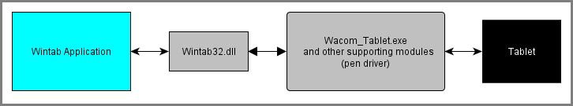

# Readme

## Introduction
This is a C++ application that uses the Wintab API to receive stylus position and orientation data from one attached Wacom tablet. The application visualizes position and tilt interactions.

This demo shows how an application can use Wintab to:

* Connect to Wintab-enabled Wacom tablets.
* Open an application-private Wintab context.
* Receive message notification when data is available, as well as notification of other tablet events (such as when a pen comes into proximity, etc.).

To test the application, a Wacom tablet driver must be installed and a supported Wacom tablet must be attached. All Wacom tablets supported by the Wacom driver are supported by this API. Get the driver that supports your device at: https://www.wacom.com/support/product-support/drivers.

## Application Details
The application uses an installed driver module, Wintab32.dll, to communicate with the tablet driver.  If the driver is not installed, is not communicating, or there is no supported Wacom tablet attached or in the preferences, then the program will display an appropriate warning.

The following illustrates a simplified overview of the major Wintab-supporting components:  

You can view the sample code's inline comments for detailed information about the sample code itself.

## See Also

[Wintab Basics](https://developer-docs.wacom.com/intuos-cintiq-business-tablets/docs/wintab-overview) - How to configure and write Wintab applications

[Wintab Reference](https://developer-docs.wacom.com/intuos-cintiq-business-tablets/docs/wintab-reference) - Complete API details

[Wintab FAQs](https://developer-support.wacom.com/hc/en-us/articles/12844524637975-Wintab) - Wintab programming tips

## Where To Get Help
If you have questions about this demo or the Wintab API, please visit our support page: https://developer.wacom.com/developer-dashboard/support.

## License
This sample code is licensed under the MIT License: https://choosealicense.com/licenses/mit/.